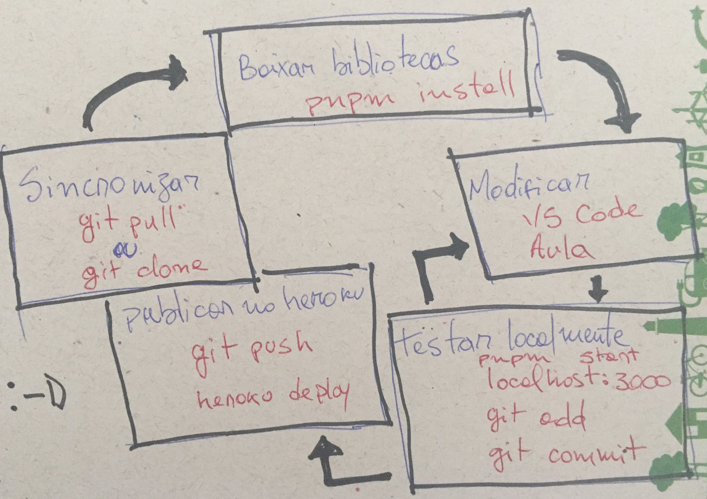

# Introdução ao React

## Sumário

1. [Meu primeiro web app](2021/01-first-app)

## Fluxo de trabalho

## Ferramentas

### Ferramentas online

-  [codesandbox](https://codesandbox.io/s/nk8nkn4q40)

### Ferramentas no desktop

-  Javascript
   -  [nvm](https://github.com/creationix/nvm)
   -  [node](https://nodejs.org/)
   -  Gerenciador de pacotes
      -  [npm](https://www.npmjs.com)
      -  [yarn](https://yarnpkg.com)
      -  [pnpm](https://pnpm.js.org)
   -  [babel](http://babeljs.io)
   -  [webpack](https://webpack.js.org)
-  [visual studio code](https://code.visualstudio.com)
-  [git-scm](https://git-scm.com)

## Notas antigas

[notas até 2019](index-old)
