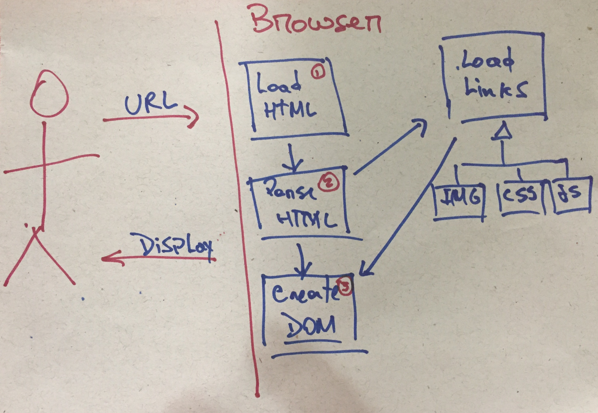
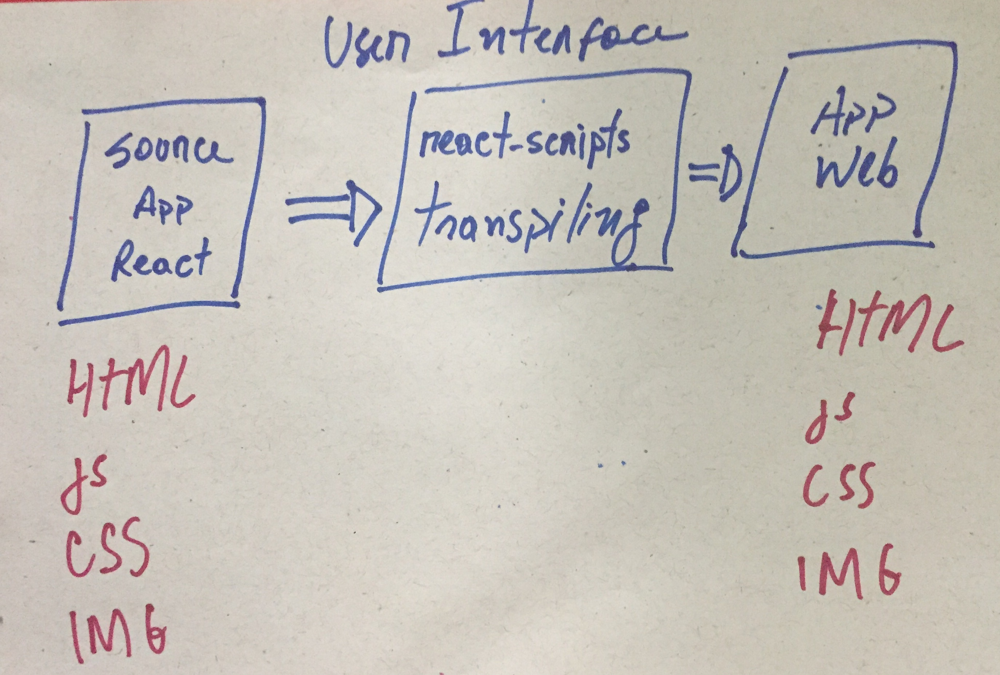
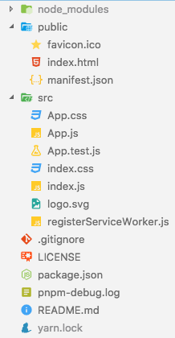
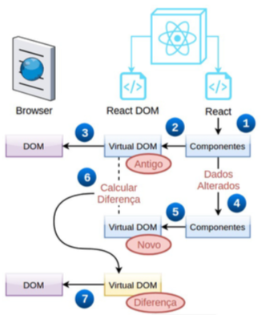

# [](#header-1) React App - Introdução


## [](#header-2) Sumário


### [](#header-3) Instalando e configurando as ferramentas

#### [](#header-4) javascript: nvm, Node, npm, pnpm

[CADES-IFRN](https://cades.natal.br) [Curso introdutório de Rect Native](https://github.com/cades-ifrn/minicurso-react-native-wtads/blob/master/install.md)

```sh
npm i -g pnpm
```

[pnpm](https://pnpm.js.org)


### [](#header-3) Testando do ambiente

```
mkdir behappywith.me
cd behappywith.me
pnpx create-react-app front-end
cd front-end
pnpm start
```


### [](#header-3) Conectando ao GitHub

- **Fork**  no repositório ```https://github.com/tiipos/behappy-frontend.git``` para sua conta!
- **Substituir** nos comandos abaixo o endereço ```https://github.com/leonardo-minora/behappy-frontend.git``` pelo seu repositório

```git
git init
git add README.md package.json pnpm-debug.log public src .gitignore
git commit -m "Aplicativo React inicial"

git remote add origin https://github.com/leonardo-minora/behappy-frontend.git
git branch --set-upstream-to=origin/master master
git pull
git push
```
Obs: se ocorrer ERRO no comando ```git pull```, tentar ```git pull --allow-unrelated-histories```

### [](#header-3) Entendento um App React

#### [](#header-4) Navegador Web: HTML, CSS e js




#### [](#header-4) App React






#### [](#header-4) Funcionamento de um App React


1. Noprimeiroacessoàpágina,oReactcriaoscomponentes;
2. OscomponentessãorenderizadosnoVirtualDOM(antigo);
3. Como se trata da primeira renderização, o DOM real é
atualizado na íntegra;
4. Os dados ( this.state ) dos componentes são alterados;
5. OscomponentessãorenderizadosnoVirtualDOM(novo);
6. O React calcula a diferença entre o Virtual DOM antigo e o
novo;
7. Por fim, o React atualiza o DOM real apenas com as
diferenças.



#### [](#header-4) Anatomia do package.json

- name, version, author
- ```dependencies``` vs ```devDependencies```
  - major version, minor version, patch releases
    - Major releases: * or x
    - Minor releases: 1 or 1.x or ^1.0.4
    - Patch releases: 1.0 or 1.0.x or ~1.0.4
- scripts

```json
{
  "name": "front-end",
  "version": "0.1.0",
  "private": true,
  "dependencies": {
    "react": "^16.4.2",
    "react-dom": "^16.4.2",
    "react-scripts": "1.1.4"
  },
  "scripts": {
    "start": "react-scripts start",
    "build": "react-scripts build",
    "test": "react-scripts test --env=jsdom",
    "eject": "react-scripts eject"
  }
}
```

#### [](#header-4) Anatomia JSX

```jsx
import React, { Component } from 'react';
import logo from './logo.svg';
import './App.css';

class App extends Component {
  render() {
    return (
      <div className="App">
        <header className="App-header">
          
          <h1 className="App-title">Welcome to React</h1>
        </header>
        <p className="App-intro">
          To get started, edit <code>src/App.js</code> and save to reload.
        </p>
      </div>
    );
  }
}

export default App;
```

#### [](#header-4) Como chega no Componente App?

**index.html**
```html
<!DOCTYPE html>
<html lang="en">
  <head>
    <meta charset="utf-8">
    <meta name="viewport" content="width=device-width, initial-scale=1, shrink-to-fit=no">
    <meta name="theme-color" content="#000000">
    <link rel="manifest" href="%PUBLIC_URL%/manifest.json">
    <link rel="shortcut icon" href="%PUBLIC_URL%/favicon.ico">
    <title>React App</title>
  </head>
  <body>
    <noscript>
      You need to enable JavaScript to run this app.
    </noscript>
    <div id="root"></div>
  </body>
</html>
```

**index.js**
```jsx
import React from 'react';
import ReactDOM from 'react-dom';
import './index.css';
import App from './App';
import registerServiceWorker from './registerServiceWorker';

ReactDOM.render(
  <App />, 
  document.getElementById('root'));
registerServiceWorker();
```
