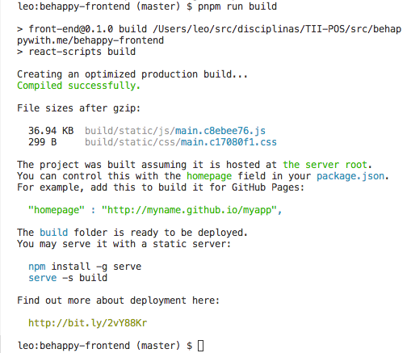
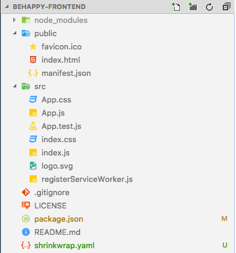
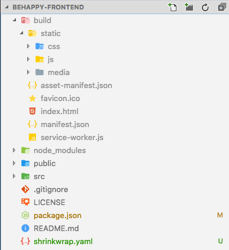
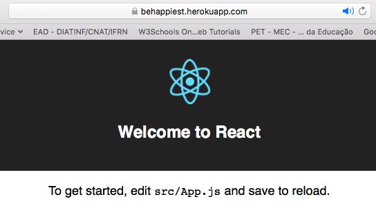
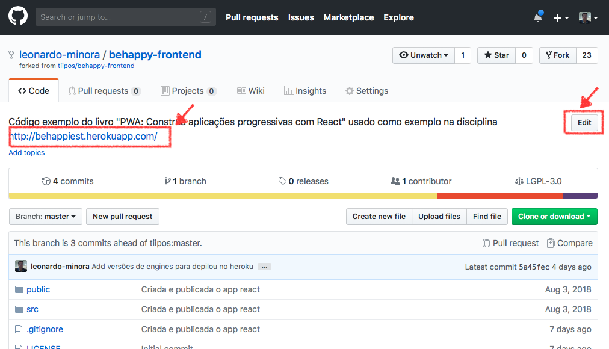

# [](#header-1) React App - Build and Deploy

## [](#header-2) Sumário

1. Introdução
2. Fazendo o build
3. Realizando deploy
4. Tarefa de "_casa_"

## [](#header-2) 1. Introdução

- **build** construir um instalável
- **deploy** executar uma instalação
- **publicar** publicar código-fonte ou app instalável

## [](#header-2) 2. Fazendo build

```sh
cd [nick]/behappywith.me
pnpm run build
```







## [](#header-2) 3. Realizando deploy

**O que é instalar um app web?**

### [](#header-3) 3.1. configurar o app

**PASSO 1.** _adicionar_ a `package.json`

```json
  "author": {
    "name": "Leonardo MINORA",
    "email": "leonardo.minora@ifrn.edu.br"
  },
  "engines": {
    "npm": "6.7.0",
    "node": "11.10.0"
  },
```

_obs_: lembre de modificar seu nome e email!!!

**arquivo final**

```json
{
  "name": "behappy",
  "version": "0.1.0",
  "private": true,
  "author": {
    "name": "Leonardo MINORA",
    "email": "leonardo.minora@ifrn.edu.br"
  },
  "engines": {
    "npm": "6.7.0",
    "node": "11.10.0"
  },
  "dependencies": {
    "react": "^16.8.2",
    "react-dom": "^16.8.2",
    "react-scripts": "2.1.5"
  },
  "scripts": {
    "start": "react-scripts start",
    "build": "react-scripts build",
    "test": "react-scripts test",
    "eject": "react-scripts eject"
  },
  "eslintConfig": {
    "extends": "react-app"
  },
  "browserslist": [">0.2%", "not dead", "not ie <= 11", "not op_mini all"]
}
```

**PASSO 2.** _Remover_ o arquivo `yarn.lock`

```sh
git rm yarn.lock                                   # mark file to remove
git commit -m "2019 Removendo o arquivo yarn.lock" # remove file
git push # publish
```

**PASSO 3.** _Ignorando_ o arquivo `yarn.lock`

_modificar_ o arquivo `.gitignore`

```sh
# dependencies
/node_modules
/.pnp
.pnp.js

# testing
/coverage

# production
/build

# misc
.DS_Store
.env.local
.env.development.local
.env.test.local
.env.production.local

# log files
npm-debug.log*
yarn-debug.log*
yarn-error.log*

# lock files
yarn.lock
package-lock.json
```

```sh
git add .gitignore
git commit -m "2019 Update gitignore file list"
git push
```

### [](#header-3) 3.2. Publicar modificação no GitHub

```sh
git add package.json
git commit -m "2019 Add info do dev e das engines"
git push
```

### [](#header-3) 3.3. Publicando o projeto

**Herokuu**

1. Acessar site http://heroku.com/
2. Criar conta no Heroku
3. No [dashboard](https://dashboard.heroku.com/apps) do Heroku, criar um app
4. No _dashboard_ do seu app, clicar na aba _Deploy_
5. Em _Deployment method_, selecionar GiHub
6. Definir qual o repositório esta o app
7. Em _Manual deploy_, clicar em _Deploy Branch_
8. Aguardar um tempo, olhando o log
9. No topo da página, clicar em _Open app_



## [](#header-2) 4. Tarefa final

1. Acessar no seu repositório do App React no GitHub
2. Copiar endereço (URL) da App React no Heroku para o repositório GitHub


