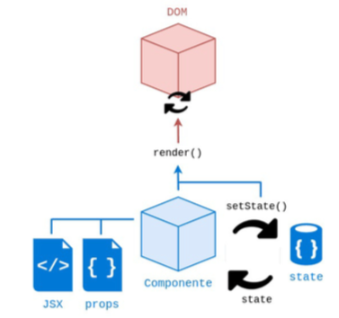
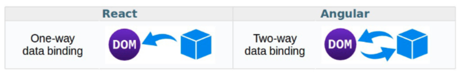
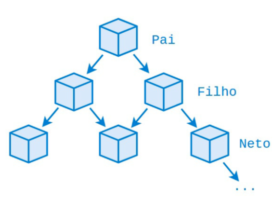
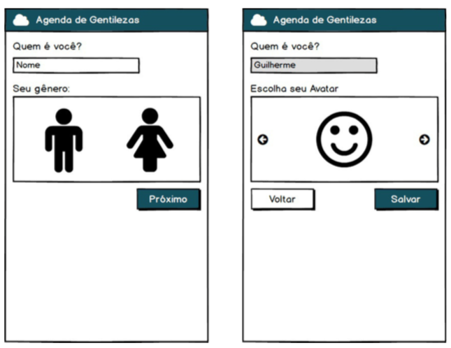
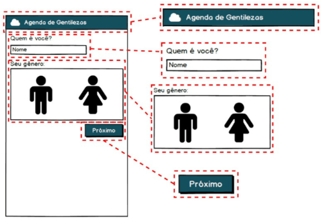
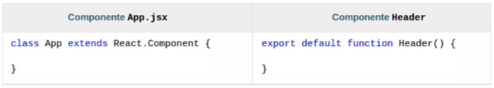

# [](#header-1) React App - JSX and Components

## [](#header-2) Sumário

1. Arquivos JSX
2. React components
3. BeHappy components
4. Colocando projeto no ar
5. Tarefa :P


## [](#header-2) 1. JSX (relembrando)

```jsx
import React, { Component } from 'react';
import logo from './logo.svg';
import './App.css';

class App extends Component {
  render() {
    return (
      <div className="App">
        <header className="App-header">
          
          <h1 className="App-title">Welcome to React</h1>
        </header>
        <p className="App-intro">
          To get started, edit <code>src/App.js</code> and save to reload.
        </p>
      </div>
    );
  }
}

export default App;
```


## [](#header-2) 2. React Components (relembrando)









## [](#header-2) 3. BeHappy Components - colocando a mão na massa

**sumário** :
1. Goal
2. Protótipos de componentes
3. Componente App
4. Componente Header
5. Componente Novo Usuário
6. Componente Label


```sh
cd [nickname]/behappywith.me

git pull

git config --global --unset user.name
git config --global --unset user.email

git config user.name "Leonardo MINORA"
git config user.email "leonardo.minora@gmail.com"

mkdir src/css
git mv src/index.css src/css
curl https://unpkg.com/purecss@1.0.0/build/pure-min.css --output src/css/pure.css

pnpm install
pnpm start
```

[pure.css](http://purecss.io/)


### [](#header-3) 3.1. Goal




### [](#header-3) 3.2.Planning components



[Tamanho de telas](http://viewportsizes.com)


### [](#header-3) 3.3. App Component

1. ```./src/App.js```
2. ```./src/index.js```


### [](#header-3) 3.4. Head Component



- **diretório** : ```./src/components/Header```
- **arquivos** : ```index.js```, ```Header.js```, ```index.css```, e ```img/logo.png```

**arquivo** : ```img/logo.png```


**arquivo** : ```index.js```
```jsx
import Header from './Header';

export default Header;
```

**arquivo** : ```Header.js```
```jsx
import React from 'react';

import './index.css';

export default function Header() {
  return (
    <div className="header pure-menu pure-menu-horizontal pure-menu-fixed">
      <a href="/"></a>
      <h4 className="label">Agenda de gentileza</h4>
    </div>
  )
}
```

**arquivo** : ```index.css```
```css
div.header {
  background-color: #2c80b9;
  min-width: 320px;    
}

div.header img {
  display: block;
  margin: 0;
}

div.header img.logo {
  float: left;
  height: 92px;
  width: 164px;
}

div.header h4.label {
  color: #ffffff;
  font-weight: normal;
  line-height: 92px;
  float: left;
  margin: 0;
}

@media (max-width: 992px) {
  div.header img.logo {
      height: 78px;
      width: 139px;
  }
  div.header h4.label {
      line-height: 78px;
  }
}

@media (max-width: 600px) {
  div.header img.logo {
      height: 62px;
      width: 110px;
  }
  div.header h4.label {
      line-height: 62px;
  }
}
```

**arquivo** : ```./src/App.js```
```jsx
import React, { Component } from 'react';
import logo from './logo.svg';

import './App.css';
import Header from './components/Header';
import NewUser from './components/NewUser';

class App extends Component {
  render() {
    return (
      <div>
        <Header />
      </div>
    );
  }
}

export default App;
```


### [](#header-3) 3.5. NewUser Component

- **diretório** : ```./src/components/NewUser```
- **arquivos** : ```index.js```, e ```NewUser.js```

**arquivo** : ```index.js```
```jsx
import NewUser from './NewUser';

export default NewUser;
```

**arquivo** : ```NewUser.js```
```jsx
import React, {Component} from 'react';

import Label from '../Label';

class NewUser extends Component {
  render() {
    return (
      <div className="center">
        <form className="pure-form pure-form-stacked">
          <p>Quem é você</p>
        </form>
      </div>
    );
  }
}

export default NewUser;
```

**arquivo** : ```./src/App.js```
```jsx
import React, { Component } from 'react';
import logo from './logo.svg';

import './App.css';
import Header from './components/Header';
import NewUser from './components/NewUser';

class App extends Component {
  render() {
    return (
      <div>
        <Header />
        <NewUser />
      </div>
    );
  }
}

export default App;
```

**arquivo** : ```./src/css/index.css```
```css
body {
  margin: 0;
  padding: 0;
  font-family: sans-serif;
}

div.center {
  box-sizing: border-box;
  padding: 5px;
  display: table;
  margin: 0 auto;
  min-width: 320px;
  margin-top: 92px;
}

@media (max-width: 992px) {
  div.center {
    margin-top: 78px;
  }
}
@media (max-width: 600px) {
  div.center {
    margin-top: 62px;
  }
}
```


### [](#header-3) 3.6. Label Component

**diretório** : ```./src/components/Label```
**arquivos** : ```index.js```, e ```Label.js```

**arquivo** : ```index.js```
```jsx
import Label from './Label';

export default Label;
```

**arquivo** : ```Label.js```
```jsx
import React from 'react';

export default function Label(props) {
  const style = {
    color: props.invalidValue ? '#d50000' : '#444444', 
  };

  return (
    <label style={style} htmlFor={props.htmlFor}>{props.text}</label>
  );
}
```

**arquivo** : ```./src/components/NewUser.js```
```jsx
import React, {Component} from 'react';

import Label from '../Label';

class NewUser extends Component {
  render() {
    return (
      <div className="center">
        <form className="pure-form pure-form-stacked">
          <Label htmlFor="name" text="Quem é você?" />
        </form>
      </div>
    );
  }
}

export default NewUser;
```


## [](#header-2) 4. Heroku

1. Publicar no GitHub
2. Instalar no Heroku

```sh
git add src/App.js src/css src/img src/components
git commit -m "Aula sobre componentes Reat"
git push
```

[heroku app](http://heroku.com/)


## [](#header-2) 5. Homework

**Just do it!!!**
