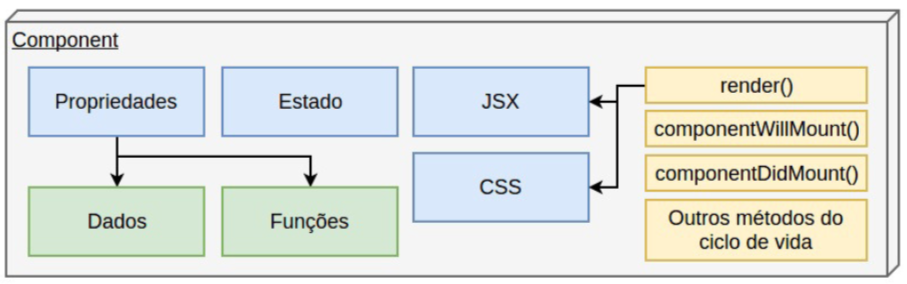
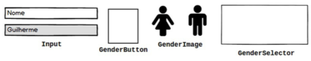
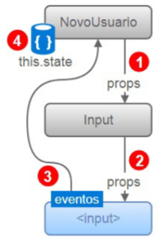
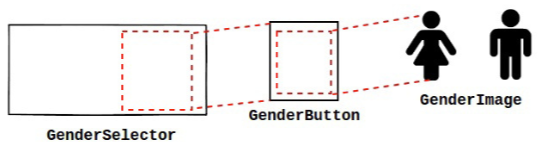
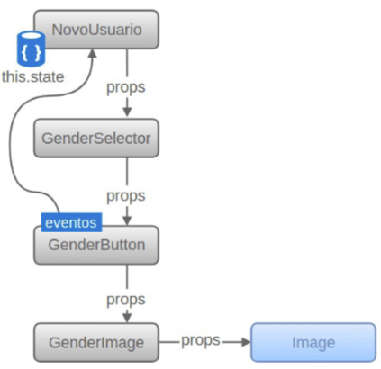

# [](#header-1) React App - State

## [](#sumario) Sumário

1. [Objetivos](#-1-objetivos)
2. [Estado de Componentes React](#-2-estado-de-componentes-react)
3. [Um pouco de javascript](#-3-um-pouco-de-javascript)
4. [Preparando para programar](#4-preparando-para-programar)
5. [Programando os componentes](#-5-programando-os-componentes)
6. [Registrando as mudanças](#-6-registrando-as-mudanças)
7. [Publicando no Heroku](#-7-publicando-no-heroku)
8. [Homework](#-8-homework)

## [](#header-2) 1. Objetivos

- React
  - Entender o funcionamento de estado de um componente
- BeHappy.Me
  - Criar os componentes: Input, GenderButton, GenderImage, GenderSelector
  - Modificar os componentes: App, NewUser

## [](#header-2) 2. Estado de Componentes React



**Estado, valores**

- Expressos como objeto javascript `{attr1: value, attr2: value}`
- Inicializados no método `constructor`
- Modificados no método `setState`

### [](#header-3) 2.1. Exemplo

**src/App.js**

```jsx
class App extends React.Component {
  constructor(props) {
    super(props);
    this.state = {
      cor: white,
      contador: 0
    };
  }

  trocarCor = e => {
    let contador = this.state.contador;
    let cor = ++contador % 2 == 0 ? "red" : "blue";
    this.setState({
      cor: cor,
      contador: contador
    });
  };

  render() {
    const estilo = {
      padding: 10,
      background: this.state.cor
    };
    return (
      <h1 style={estilo} onClick={this.trocarCor}>
        {this.props.texto}
      </h1>
    );
  }
}
```

**src/index.js**

```jsx
import React from 'react';
import ReactDOM from 'react-dom';
import './index.css';
import App from './App';
import registerServiceWorker from './registerServiceWorker';

ReactDOM.render(
  <App texto="Olá mundo!" />,
  document.querySelector("root");
);
registerServiceWorker();
```

## [](#header-2) 3. Um pouco de javascript

1. IO não bloqueante (programação assíncrona e callback)
2. Arrow functions
3. Spread Operator `...`
4. `Object.assign()`
5. Template string

### [](#header-3) 3.1. **IO não bloqueante** (programação assíncrona e callback)

**primeiro exemplo**

```js
function funcaoNaoBloqueante(par, callback) {
  // API assíncrona de consulta ao servidor
  // Cria uma variável resultado
  callback(resultado);
}

let texto1 = funcaoBloqueante();
let texto2 = funcaoNaoBloqueante(texto1, function(variavel_resultado) {
  codigo;
});
funcaoBloqueante(texto2);
```

**segundo exemplo**

```js
const fs = require("fs");
var fileContent = "";

function sincrono() {
  fileContent = "";
  const someMath = 1 + 1;

  try {
    fileContent = fs.readFileSync("big-file.txt", "utf-8");
    console.log("file has been read");
  } catch (err) {
    console.log(err);
  }

  const text = `The sum is ${someMath}`;
  console.log(text);
  console.log(fileContent);
}

function assincrono() {
  fileContent = "";
  const someMatch = 1 + 1;

  fs.readFile("big-file.txt", "utf-8", function(err, content) {
    if (err) {
      return console.log(err);
    }
    fileContent = content;
  });

  const text = `The response is ${someMatch}`;
  console.log(text);
  console.log(fileContent);
}

sincrono();
assincrono();
```

### [](#header-3) 3.2. **Arrow functions**

```js
function a(par) {
  // código
}

const b = function(par) {
  // código
};

// ARROW Function
const c = par => {
  // código
};
```

### [](#header-3) 3.3. **Spread Operator** `...`

```jsx
export default function Input(props) {
  return (
    <input
      type="text"
      id={props.id}
      placeholder={props.placeholder}
      maxLength={props.maxLength}
    />
  );
}

export default function Input(props) {
  return (
    <input
      type="text"
      {...props}
    />
  );
}
```

### [](#header-3) 3.4. **Object.assign()**

```jsx
let aluno = {
  nome: "Leonardo Minora",
  email: "leonardo.minora@ifrn.edu.br"
};
console.log(aluno);
//{ nome: 'Leonardo Minora',
//  email: 'leonardo.minora@ifrn.edu.br' }

let novoAluno = Object.assign({ matricula: "22958" }, aluno);
console.log(novoAluno);
// { matricula: '22958',
//   nome: 'Leonardo Minora',
//   email: 'leonardo.minora@ifrn.edu.br' }
```

### [](#header-3) **template string**

```js
console.log("auto " + 2 * 3 * -1 + "px");
// auto -6px

console.log(`auto ${2 * 3 * -1}px`);
// auto -6px
```

## [](#header-2) 4. Preparando para programar

### [](#header-3) 4.1. App no computador

**executar no terminal**

```sh
cd [nickname]/behappywith.me
git pull

### Modifica informações do desenvolvedor
git config --global --unset user.name
git config --global --unset user.email
git config user.name "$NOME"
git config user.email "$EMAIL"

### download da imagem a ser utilizada nos componentes
mkdir public/img
curl https://github.com/tiipos/tiipos.github.io/raw/master/react/img/behappy/avatars.png --output public/img/avatars.png

### Instala as bibliotecas e executa o app
pnpm install
pnpm start
```

### [](#header-3) 4.2. NÃO TEM o código no computador

**executar no terminal**

```sh
### Mudar o [nickname] pelo nome seu nome
mkdir [nickname]
cd [nickname]
### Mudar o [github-username] pelo seu nickname do GitHub
git clone https://github.com/[github-username]/behappy-frontend.git

### Mudar $NOME pelo seu nome e $EMAIL pelo email usado no GitHub
git config --global --unset user.name
git config --global --unset user.email
git config user.name "$NOME"
git config user.email "$EMAIL"

### download da imagem a ser utilizada nos componentes
mkdir public/img
curl https://github.com/tiipos/tiipos.github.io/raw/master/react/img/behappy/avatars.png --output public/img/avatars.png

### Instala as bibliotecas e executa o app
pnpm install
pnpm start
```



## [](#header-2) 5. Programando os componentes

1. [Comoponente Input](#-51-comoponente-input)
2. [Componente Image](#-52-compnente-image)
3. [Compnente GenderImage](#-53-compnente-genderimage)
4. [Componente GenderButton](#-54-componente-genderbutton)
5. [Componente GenderSelector](#-55-componente-genderselector)

### [](#header-3) 5.1. Comoponente Input

**Características**

1. Um mecanismo para que os outros componentes obtenham o valor digitado;
2. Um atributo identificar;
3. Um valor de placeholder;
4. Um tamanho máximo de caracteres;
5. Um indicador para mostrar se é _read-only_ ou não;
6. Um indicador de que está ou não corretamente preenchido
7. Um valor padrão.



**executar no terminal**

```sh
mkdir src/components/Input
touch src/components/Input/index.js
touch src/components/Input/Input.js
```

- editar com o VS Code **src/components/Input/index.js**

```jsx
import Input from "./Input";

export default Input;
```

- editar com o VS Code **src/components/Input/Input.js**

```jsx
import React from "react";

export default function Input(props) {
  const style = {
    borderColor: props.invalidValue ? "#d50000" : "#cccccc",
    backgroundColor: props.invalidValue ? "#ffcdd2" : "#ffffff"
  };
  let properties = Object.assign({}, props);
  delete properties.invalidValue;

  return <input type="text" style={style} {...properties} />;
}
```

- editar com o VS Code **src/components/NewUser/NewUser.js**

```jsx
import React, { Component } from "react";

import Label from "../Label";
import Input from "../Input";

class NewUser extends Component {
  constructor(props) {
    super(props);
    this.state = {
      user: {
        name: "Minora"
      },
      validation: {
        invalidName: false
      }
    };
  }

  updateUserName = event => {
    let user = this.state.user;
    user.name = event.target.value;
    this.setState({
      user: user
    });
  };

  render() {
    return (
      <div className="center">
        <form className="pure-form pure-form-stacked">
          <Label
            htmlFor="name"
            text="Quem é você?"
            invalidValue={this.state.validation.invalidName}
          />
          <Input
            id="name"
            placeholder="Digite seu nome"
            maxLength="40"
            readOnly={false}
            invalidValue={this.state.validation.invalidName}
            defaultValue={this.state.user.name}
            onChange={this.updateUserName}
          />
        </form>
      </div>
    );
  }
}

export default NewUser;
```

### [](#header-3) Entendendo os componentes Image e GenderImage





**lógica**

1. Um mecanismo para que os outros componentes obtenham o valor;
2. Um gênero selionado;
3. Um indicador de que está ou não corretamente preenchido;
4. Um indicador de seleção de gênero selecionado.


**Sprites**

- Referências
  - [W3C CSS Image Sprites](https://www.w3schools.com/css/css_image_sprites.asp)
  - [Utilizando CSS sprites para otimizar o carregamento de imagens em seu site](https://www.hostgator.com.br/blog/css-sprites-para-otimizar-imagens-em-seu-site/)
- Ferramentas
  - [SpriteCow](http://www.spritecow.com)
  - [CSS Sprites](http://css.spritegen.com)
  - [CSS Sprite Generator](https://spritegen.website-performance.org)
  - [CSS Sprite tool](http://cssspritestool.com)

#### [](#header-3) 5.2. Compnente Image

**executar no terminal**

```sh
mkdir src/components/Image
touch src/components/Image/index.js
touch src/components/Image/Image.js
```

- editar com o VS Code **src/components/Image/index.js**

```jsx
import Image from "./Image";

export default Image;
```

- editar com o VS Code **src/components/Image/Image.js**

```jsx
import React, { Component } from "react";

class Image extends Component {
  // constructor(props) {
  //   super(props);
  // }

  calcPositionX = () => {
    return this.props.x * this.props.width * -1 + "px";
  };

  calcPositionY = () => {
    return `${this.props.y * this.props.height * -1}px`;
  };

  calcSize = () => `auto ${this.props.backgroundHeight}px`;

  calcStyle = () => {
    return {
      backgroundImage: `url(${this.props.file})`,
      backgroundPositionX: this.calcPositionX(),
      backgroundPositionY: this.calcPositionY(),
      width: `${this.props.width}px`,
      height: `${this.props.height}px`,
      display: "table",
      margin: "0 auto"
    };
  };

  render() {
    return <div style={this.calcStyle()} />;
  }
}

export default Image;
```

#### [](#header-3) 5.3. Compnente GenderImage

**executar no terminal**

```sh
mkdir src/components/GenderImage
touch src/components/GenderImage/index.js
touch src/components/GenderImage/GenderImage.js
```

- editar com o VS Code **src/components/GenderImage/index.js**

```jsx
import GenderImage from "./GenderImage";

export default GenderImage;
```

- editar com o VS Code **src/components/GenderImage/GenderImage.js**

```jsx
import React from "react";

import Image from "../Image";

export default function GenderImage(props) {
  return (
    <Image
      x={0}
      y={props.gender === "m" ? 0 : 1}
      width={170}
      height={170}
      backgroundHeight={340}
      file="img/avatars.png"
    />
  );
}
```

#### [](#header-4) Modificar o NewUser para visualizar o resultado

- editar com o VS Code **src/components/NewUser/NewUser.js**

```jsx
import React, { Component } from "react";

import Label from "../Label";
import Input from "../Input";
import GenderImage from "../GenderImage";

class NewUser extends Component {
  constructor(props) {
    super(props);
    this.state = {
      user: {
        name: "Minora"
      },
      validation: {
        invalidName: false
      }
    };
  }

  updateUserName = event => {
    let user = this.state.user;
    user.name = event.target.value;
    this.setState({
      user: user
    });
  };

  render() {
    return (
      <div className="center">
        <form className="pure-form pure-form-stacked">
          <Label
            htmlFor="name"
            text="Quem é você?"
            invalidValue={this.state.validation.invalidName}
          />
          <Input
            id="name"
            placeholder="Digite seu nome"
            maxLength="40"
            readOnly={false}
            invalidValue={this.state.validation.invalidName}
            defaultValue={this.state.user.name}
            onChange={this.updateUserName}
          />
          <GenderImage gender="m" />
          <GenderImage gender="f" />
        </form>
      </div>
    );
  }
}

export default NewUser;
```

### [](#header-3) 5.4. Componente GenderButton

**executar no terminal**

```sh
mkdir src/components/GenderButton
touch src/components/GenderButton/index.js
touch src/components/GenderButton/index.css
touch src/components/GenderButton/GenderButton.js
```

- editar com o VS Code **src/components/GenderButton/index.js**

```jsx
import GenderButton from "./GenderButton";

export default GenderButton;
```

- editar com o VS Code **src/components/GenderButton/index.css**

```css
a.gender-button {
  box-sizing: border-box;
  width: 180px;
  height: 180px;
  border-radius: 10px;
  margin: 3px;
  padding-top: 5px;
  display: inline-block;
}

a.gender-button:hover {
  background-color: #dbdbdb;
}

a.selected-gender-button {
  background-color: #00c853;
}

a.selected-gender-button:hover {
  background-color: #00c853;
}
```

- editar com o VS Code **src/components/GenderButton/GenderButton.js**

```jsx
import React from "react";

import "./index.css";
import GenderImage from "../GenderImage";

export default function GenderButton(props) {
  return (
    <a
      className={
        props.selected
          ? "gender-button selected-gender-button"
          : "gender-button"
      }
      href="#!"
      onClick={event => props.updateGender(event, props.gender)}
    >
      <GenderImage gender={props.gender} />
    </a>
  );
}
```

### [](#header-3) 5.5. Componente GenderSelector

**executar no terminal**

```sh
mkdir src/components/GenderSelector
touch src/components/GenderSelector/index.js
touch src/components/GenderSelector/GenderSelector.js
```

- editar com o VS Code **src/components/GenderSelector/index.js**

```jsx
import GenderSelector from "./GenderSelector";

export default GenderSelector;
```

- editar com o VS Code **src/components/GenderSelector/GenderSelector.js**

```jsx
import React from "react";

import GenderButton from "../GenderButton";

export default function GenderSelector(props) {
  const male = props.gender === "m";
  const female = props.gender === "f";
  const cor = props.invalidValue ? "#d50000" : "#cccccc";
  const style = {
    boxSizing: "border-box",
    border: `1px solid ${cor}`,
    borderRadius: "5px",
    padding: "3px",
    paddingBottom: "0"
  };

  return (
    <div style={style}>
      <GenderButton
        selected={female}
        gender={"f"}
        updateGender={props.updateGender}
      />
      <GenderButton
        selected={male}
        gender={"m"}
        updateGender={props.updateGender}
      />
    </div>
  );
}
```

### [](#header-3) Modificar o NewUser para visualizar o resultado

- editar com o VS Code **src/components/NewUser/NewUser.js**

```jsx
import React, { Component } from "react";

import Label from "../Label";
import Input from "../Input";
import GenderSelector from "../GenderSelector";

class NewUser extends Component {
  constructor(props) {
    super(props);
    this.state = {
      user: {
        name: "",
        gender: ""
      },
      validation: {
        invalidName: false,
        invalidGender: false
      }
    };
  }

  updateUserName = event => {
    let user = this.state.user;
    user.name = event.target.value;
    this.setState({
      user: user
    });
  };

  updateUserGender = (event, gender) => {
    event.preventDefault();
    let user = this.state.user;
    user.gender = gender;
    this.setState({
      user: user
    });
  };

  render() {
    return (
      <div className="center">
        <form className="pure-form pure-form-stacked">
          <Label
            htmlFor="name"
            text="Quem é você?"
            invalidValue={this.state.validation.invalidName}
          />
          <Input
            id="name"
            placeholder="Digite seu nome"
            maxLength="40"
            readOnly={false}
            invalidValue={this.state.validation.invalidName}
            defaultValue={this.state.user.name}
            onChange={this.updateUserName}
          />
          <Label
            text="Seu gênero:"
            invalidValue={this.state.validation.invalidGender}
          />
          <GenderSelector
            invalidValue={this.state.validation.invalidGender}
            gender={this.state.user.gender}
            updateGender={this.updateUserGender}
          />
        </form>
      </div>
    );
  }
}

export default NewUser;
```

## [](#header-2) 6. Registrando as mudanças

1. Fechar servidor web `CTRL + C`
2. Adicioanar novos e modificados arquivos (`git add`) no repositório local
3. Registrar mudanças (`git commit`) no repositório local
4. Publicar mudanças no repositório remoto (`git pull` e `git push`)

- Executar no _Terminal 1_

```sh
### 1. Pressionar CTRL+C para fechar o servidor
###

### 2. Adicionar arquivos novos e modificados no repositório local
git add src/components public/img/avatars.png

### 3. Registrar mudanças no repositório local
git commit -m "$MSG"

### Publicar as mudanças no repositório remoto
git pull
git push
```

## [](#header-2) 7. Publicando no Heroku

1. Acessar o [Heroku](https://www.heroku.com) e se autenticar
2. Acessar o link do seu _App_ no Heroku
3. No _dashboard_ do seu _App_, clicar na aba _Deploy_
4. Em _Deployment method_, selecionar GiHub
5. Definir qual o repositório esta o _App_
6. Em _Manual deploy_, clicar em _Deploy Branch_
7. Aguardar um tempo, olhando o log
8. No topo da página, clicar em _Open App_

## [](#header-2) 8. Homework

**Do it!!!**
