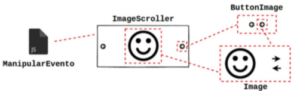
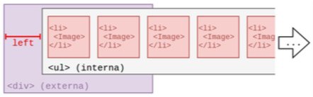
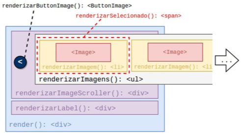

# [](#header-1) React App - Componentes complexos e domínio de aplicação

## [](#header-2) Objetivos

- React
  - Adicionar classes de domínio
  - Adicionar o componentes complexos
- BeHappy.Me
  - Criar os componentes: Button, ButtonImage, ImageScroller, Toast
  - Modificar os componentes: App, Image, NewUser
  - Adicionar transição de telas




## [](#header-2) Sumário

1. Adicionar domínio da aplicação
2. Criar e testar o componente Button
3. Criar e testar o componente ImageScroller
4. Registrar as mudanças no repositório do github
5. Publicar no Heroku


**para quem não tem o pnpm, npm, node**
```sh
nvm install node
npm -v
node -v
npm i -g pnpm
```

```sh
### Tudo que iniciar com $ deverá ser substituído
### pelo valor correspondente

### se o código não estiver no seu computador, execute
### git clone $URL_REPOSITORIO
cd $APP_DIR
git pull

### Modifica informações do desenvolvedor
git config --global --replace-all user.name "$NOME"
git config --global --replace-all user.email "$EMAIL"

### Instala as bibliotecas do app
pnpm install

### Inicia o App
pnpm start
```


## [](#header-2) 1. Adicionar o domínio da aplicação

1. Criar diretório para o domínio
2. Criar e editar a classe Usuário do domínio
3. Modificar o componente React/BeHappyWith.Me NewUser


**src/models/User.js**

```js
export default class User {
  constructor() {
    this.name = '';
    this.gender = '';
  }

  validName = () => {
    return (
      typeof this.name === 'string' &&
      this.name.length !== 0 && 
      this.name.length <= 40
    );
  }

  validGender = () => {
    return ['m', 'f'].some(param => {
      return this.gender === param;
    });
  }
```


**src/components/NewUser/NewUser.js**

```jsx
import React, {Component} from 'react';

import Label from '../Label';
import Input from '../Input';
import GenderSelector from '../GenderSelector';
import User from '../../models/User';

class NewUser extends Component {
  constructor(props) {
    super(props);
    this.state = {
      user: new User(),
      validation: {
        invalidName: false,
        invalidGender: false
      }
    };
  }

  updateUserName = (event) => {
    let user = this.state.user;
    user.name = event.target.value;
    this.setState({
      user: user
    });
  }

  updateUserGender = (event, gender) => {
    event.preventDefault();
    let user = this.state.user;
    user.gender = gender;
    this.setState({
      user: user
    });
  }

  render() {
    return (
      <div className="center">
        <form className="pure-form pure-form-stacked">
          <Label 
              htmlFor="name" 
              text="Quem é você?" 
              invalidValue={this.state.validation.invalidName} />
          <Input 
              id="name" 
              placeholder="Digite seu nome" 
              maxLength="40" 
              readOnly={false}
              invalidValue={this.state.validation.invalidName}
              defaultValue={this.state.user.name}
              onChange={this.updateUserName}
          />
          <Label
            text="Seu gênero:"
            invalidValue={this.state.validation.invalidGender}
          />
          <GenderSelector
            invalidValue={this.state.validation.invalidGender}
            gender={this.state.user.gender}
            updateGender={this.updateUserGender}
          />
        </form>
      </div>
    );
  }
}

export default NewUser;
```


## [](#header-2) 2. Criar o componente Button

**Sub-tarefas**

1. Criar e testar o componente Button;
2. Validar os dados do usuário;
3. Apresentar mensagens de erro;
4. Finalizar a 1a tela de novo usuário.


### [](#header-3) 2.1 Criar e testar o componente Button

1. Criar o diretório para o componente React/BeHappyWith.Me Button
2. Criar e editar o componente React/BeHappyWith.Me Button
3. Modificar o componente React/BeHappyWith.Me NewUser

```sh
mkdir src/components/Button
touch src/components/Button/index.js
touch src/components/Button/Button.js
```

**src/components/Button/index.js**

```jsx
import Button from './Button';

export default Button;
```


**src/components/Button/Button.js**

```jsx
import React from 'react';

export default function Button(props) {

  const className = props.main ?
    'pure-button pure-button-primary' :
    'pure-button';
  const style = {
    boxSizing: 'border-box',
    backgroundColor: props.main ? '#2c80b9' : '#e6e6e6',
    float: props.main ? 'right' : 'left',
    marginTop: '10px',
    width: '120px',
    height: '38px'
  };

  return (
    <button
      className={className}
      style={style}
      onClick={props.onClick}
    >
      {props.text}
    </button>
  );
}
```


**src/components/NewUser/NewUser.js** 1a Versão : testando o componente

```jsx
import React, {Component} from 'react';

import Label from '../Label';
import Input from '../Input';
import GenderSelector from '../GenderSelector';
import Button from '../Button';
import User from '../../models/User';

class NewUser extends Component {
  constructor(props) {
    super(props);
    this.state = {
      user: new User(),
      validation: {
        invalidName: false,
        invalidGender: false
      }
    };
  }

  updateUserName = (event) => {
    let user = this.state.user;
    user.name = event.target.value;
    this.setState({
      user: user
    });
  }

  updateUserGender = (event, gender) => {
    event.preventDefault();
    let user = this.state.user;
    user.gender = gender;
    this.setState({
      user: user
    });
  }

  valid = (e) => {
    e.preventDefault();
    console.log('O botão próximo foi clicado...');
  }

  render() {
    return (
      <div className="center">
        <form className="pure-form pure-form-stacked">
          <Label 
              htmlFor="name" 
              text="Quem é você?" 
              invalidValue={this.state.validation.invalidName} />
          <Input 
              id="name" 
              placeholder="Digite seu nome" 
              maxLength="40" 
              readOnly={false}
              invalidValue={this.state.validation.invalidName}
              defaultValue={this.state.user.name}
              onChange={this.updateUserName}
          />
          <Label
            text="Seu gênero:"
            invalidValue={this.state.validation.invalidGender}
          />
          <GenderSelector
            invalidValue={this.state.validation.invalidGender}
            gender={this.state.user.gender}
            updateGender={this.updateUserGender}
          />
          <Button main text="Próximo" onClick={this.valid} />
        </form>
      </div>
    );
  }
}

export default NewUser;
```


### [](#header-3) 2.2 Validar os dados do usuário

**src/components/NewUser/NewUser.js** 2a Versão : validando os dados do usuário

```jsx
import React, {Component} from 'react';

import Label from '../Label';
import Input from '../Input';
import GenderSelector from '../GenderSelector';
import Button from '../Button';
import User from '../../models/User';

class NewUser extends Component {
  constructor(props) {
    super(props);
    this.state = {
      user: new User(),
      validation: {
        invalidName: false,
        invalidGender: false
      }
    };
  }

  updateUserName = (event) => {
    let user = this.state.user;
    user.name = event.target.value;
    this.setState({
      user: user
    });
  }

  updateUserGender = (event, gender) => {
    event.preventDefault();
    let user = this.state.user;
    user.gender = gender;
    this.setState({
      user: user
    });
  }

  valid = (e) => {
    e.preventDefault();
    let user = this.state.user;
    let validation = this.state.validation;

    validation.invalidName = ! user.validName();
    validation.invalidGender = ! user.validGender();

    this.setState({
      validation: validation
    });
  }

  render() {
    return (
      <div className="center">
        <form className="pure-form pure-form-stacked">
          <Label 
              htmlFor="name" 
              text="Quem é você?" 
              invalidValue={this.state.validation.invalidName} />
          <Input 
              id="name" 
              placeholder="Digite seu nome" 
              maxLength="40" 
              readOnly={false}
              invalidValue={this.state.validation.invalidName}
              defaultValue={this.state.user.name}
              onChange={this.updateUserName}
          />
          <Label
            text="Seu gênero:"
            invalidValue={this.state.validation.invalidGender}
          />
          <GenderSelector
            invalidValue={this.state.validation.invalidGender}
            gender={this.state.user.gender}
            updateGender={this.updateUserGender}
          />
          <Button main text="Próximo" onClick={this.valid} />
        </form>
      </div>
    );
  }
}

export default NewUser;
```


### [](#header-3) 2.3 Apresentar mensagens de erro

1. Instalar o component react-toastify
2. Criar o componente React/BeHappyWith.Me de mensgagens (Toast)

```sh
# Parar o servidor web
# pressiona as teclas CTRL + C

# Instalar o componente react-toastify
pnpm install react-toastify

# Reiniciar o servidor web
pnpm start
```

[React Toastify](https://fkhadra.github.io/react-toastify/)

particularidades do ```render()```:
1. A propriedade ```position``` indical em qual trecho da tela a mensagem será exibida;
2. O Toast, por padrã, é fechado automaticamente. ```autoClose``` define o tempo para fechar mensagem em milesegundos;
3. ```hideProgressBar``` permite esconder a barra de progresso;
4. ```closeOnClick``` permite fechar a mensagem com um clique;
5. ```pauseOnHover``` interrompe contagem do tempo para fechamento.

**src/components/Toast/index.js**

```jsx
import Toast from './Toast';

export default Toast;
```


**src/components/Toast/Toast.js**

```jsx
import React, { Component } from 'react';
import { ToastContainer, toast } from 'react-toastify';
import 'react-toastify/dist/ReactToastify.css';

class Toast extends Component {

  success = (message) => {
    toast.success(message);
  }

  info = (message) => {
    toast.info(message);
  }

  error = (message) => {
    toast.error(message);
  }

  render() {
    return (
      <ToastContainer
        position="bottom-center"
        autoClose={5000}
        hideProgressBar={true}
        pauseOnHover
      />
    );
  }
}

export default Toast;
```


**src/App.js**
```jsx
import React, { Component } from 'react';
// import logo from './logo.svg';

import './App.css';
import Header from './components/Header';
import NewUser from './components/NewUser';
import Toast from './components/Toast';

class App extends Component {
  render() {
    return (
      <div>
        <Header />
        <NewUser error={msg => this.refs.toast.error(msg)} />
        <Toast ref="toast" />
      </div>
    );
  }
}

export default App;
```


**src/components/NewUser/NewUser.js**
```jsx
import React, {Component} from 'react';

import Label from '../Label';
import Input from '../Input';
import GenderSelector from '../GenderSelector';
import Button from '../Button';
import User from '../../models/User';

class NewUser extends Component {
  constructor(props) {
    super(props);
    this.state = {
      user: new User(),
      validation: {
        invalidName: false,
        invalidGender: false
      },
      firstView: false
    };
  }

  updateUserName = (event) => {
    let user = this.state.user;
    user.name = event.target.value;
    this.setState({
      user: user
    });
  }

  updateUserGender = (event, gender) => {
    event.preventDefault();
    let user = this.state.user;
    user.gender = gender;
    this.setState({
      user: user
    });
  }

  valid = (e) => {
    e.preventDefault();
    let user = this.state.user;
    let validation = this.state.validation;

    validation.invalidName = ! user.validName();
    validation.invalidGender = ! user.validGender();

    let message = '';
    let firstView = false;

    if (validation.invalidName && validation.invalidGender) {
      message = 'Por favor, informe seu nome e gênero!!!';
    } else if (validation.invalidName) {
      message = 'Por favor, informe seu nome!!!';
    } else if (validation.invalidGender) {
      message = 'Por favor, selecione seu gênero!!!';
    } else {
      firstView = true;
    }

    if (!firstView) {
      this.props.error(message);
    }

    this.setState({
      validation: validation,
      firstView: firstView
    });
  }

  render() {
    return (
      <div className="center">
        <form className="pure-form pure-form-stacked">
          <Label 
              htmlFor="name" 
              text="Quem é você?" 
              invalidValue={this.state.validation.invalidName} />
          <Input 
              id="name" 
              placeholder="Digite seu nome" 
              maxLength="40" 
              readOnly={false}
              invalidValue={this.state.validation.invalidName}
              defaultValue={this.state.user.name}
              onChange={this.updateUserName}
          />
          <Label
            text="Seu gênero:"
            invalidValue={this.state.validation.invalidGender}
          />
          <GenderSelector
            invalidValue={this.state.validation.invalidGender}
            gender={this.state.user.gender}
            updateGender={this.updateUserGender}
          />
          <Button main text="Próximo" onClick={this.valid} />
        </form>
      </div>
    );
  }
}

export default NewUser;
```


### [](#header-3) 2.4 Finalizar a 1a tela de novo usuário

Sintetizando as **2 telas** de novo usuário:
1. Deve exibir para edição os campos de nome e gênero, e o botão próximo;
2. Deve exibir o campo nome, permitir escolher um avatar, e os botões voltar e salvar.

**Quais etapas** para preparar a 1a tela:
1. Refatorar NewUser, encapsulando as entradas (jsx dentro de render) com métodos;
  1. ```renderName```
  2. ```renderGender```
  3. ```renderButtons```

**src/components/NewUser/NewUser.js**

```jsx
import React, {Component} from 'react';

import Label from '../Label';
import Input from '../Input';
import GenderSelector from '../GenderSelector';
import Button from '../Button';
import User from '../../models/User';

class NewUser extends Component {
  constructor(props) {
    super(props);
    this.state = {
      user: new User(),
      validation: {
        invalidName: false,
        invalidGender: false
      },
      completedFirstView: false
    };
  }

  updateUserName = (event) => {
    let user = this.state.user;
    user.name = event.target.value;
    this.setState({
      user: user
    });
  }

  updateUserGender = (event, gender) => {
    event.preventDefault();
    let user = this.state.user;
    user.gender = gender;
    this.setState({
      user: user
    });
  }

  valid = (e) => {
    e.preventDefault();
    let user = this.state.user;
    let validation = this.state.validation;

    validation.invalidName = ! user.validName();
    validation.invalidGender = ! user.validGender();

    let message = '';
    let completedFirstView = false;

    if (validation.invalidName && validation.invalidGender) {
      message = 'Por favor, informe seu nome e gênero!!!';
    } else if (validation.invalidName) {
      message = 'Por favor, informe seu nome!!!';
    } else if (validation.invalidGender) {
      message = 'Por favor, selecione seu gênero!!!';
    } else {
      completedFirstView = true;
    }

    if (!completedFirstView) {
      this.props.error(message);
    }

    this.setState({
      validation: validation,
      completedFirstView: completedFirstView
    });
  }

  renderName() {
    return (
      <section>
        <Label 
          htmlFor="name" 
          text="Quem é você?" 
          invalidValue={this.state.validation.invalidName}
        />
        <Input 
          id="name" 
          placeholder="Digite seu nome" 
          maxLength="40" 
          readOnly={this.state.completedFirstView}
          invalidValue={this.state.validation.invalidName}
          defaultValue={this.state.user.name}
          onChange={this.updateUserName}
        />
      </section>
    );
  }

  renderGender() {
    if (this.state.completedFirstView) {
      return null;
    } else {
      return (
        <section>
          <Label
            text="Seu gênero:"
            invalidValue={this.state.validation.invalidGender}
          />
          <GenderSelector
            invalidValue={this.state.validation.invalidGender}
            gender={this.state.user.gender}
            updateGender={this.updateUserGender}
          />
        </section>
      );
    }
  }

  renderButtons() {
    if (this.state.completedFirstView) {
      return (
        <section>
          <Button 
            text="Voltar" 
            onClick={event => {
              event.preventDefault();
              this.setState({
                completedFirstView: false
              });
            }} 
          />
          <Button text="Salvar" main />
        </section>
      );
    } else {
      return (
        <section>
          <Button main text="Próximo" onClick={this.valid} />
        </section>
      );
    }
  }

  render() {
    return (
      <div className="center">
        <form className="pure-form pure-form-stacked">
          {this.renderName()}
          {this.renderGender()}
          {this.renderButtons()}
        </form>
      </div>
    );
  }
}

export default NewUser;
```


## [](#header-2) 3. Criar e testar o componente ImageScroller

**Sub-tarefas**:
1. Criar o componente ```ButtonImage```
2. Entender o funcionamento do ```ImageScroller```
3. Criar o arquivo ```ManipularEvento.js```
4. Criar a classe de domínio ```Avajar.js```
5. Criar o componente ```ImageScroller```

```sh
# Fechar o servidor web
## Pressione CTRL+C

# copiar imagem para o diretório public/img
curl https://raw.githubusercontent.com/tiipos/tiipos.github.io/masr/react/img/behappy/botoes.png -o public/img/buttons.png

# Criar diretório do componetne ButtonImage e os arquivos
mkdir src/components/ButtonImage
touch src/components/ButtonImage/index.js
touch src/components/ButtonImage/index.css
touch src/components/ButtonImage/ButtonImage.js

# Criar diretório do componetne ImageScroller e os arquivos
mkdir src/components/ImageScroller
touch src/components/ImageScroller/index.js
touch src/components/ImageScroller/ManipularEvento.js
touch src/components/ImageScroller/ImageScroller.js

touch src/models/Avatar.js
```

### [](#header-3) 3.1 Criar o componente ```ButtonImage``` 


**src/components/ButtonImage/index.js**

```jsx
import ButtonImage from './ButtonImage';

export default ButtonImage;
```


**src/components/ButtonImage/index.css**

```css
div.option-image-scroller {
  border-radius: 50%;
  padding: 4px;
  background-color: #dbdbdb;
  margin: 62px 2px 0 2px;
}

div.option-image-scroller:hover {
  background-color: #8d8d8d;
}
```


**src/components/ButtonImage/ButtonImage.js**

```jsx
import React from 'react';

import './index.css';

import Image from '../Image';

export default function ButtonImage(props) {
  let style = {};
  let index = 0;
  const size = 30;

  if (props.position === 'right') {
    style.float = 'right';
    index = 1;
  } else {
    style.float = 'left';
    index = 0;
  }

  let properties = Object.assign({}, props);
  delete properties.position;

  return (
    <div 
      style={style} 
      className='option-image-scroller' 
      {...properties} 
    >
      <Image 
        y={0} x={index}
        width={size} height={size}
        backgroundHeight={size}
        file="img/buttons.png"
      />
    </div>
  );

}
```


### [](#header-3) 3.2 Entender o funcionamento de ```ImageScroller```




### [](#header-3) 3.3 Criar o arquivo ```ManipularEvento.js```

**src/components/ImageScroller/ManipularEvento.js**

```js
class ManipularEvento {
  constructor(qtdeElementos,index) {        
      this.maxIndex = qtdeElementos;
      this.index = index;
      
      this.comprimentoItem = 140;
      this.maxLeft = 86;
      this.left = this.maxLeft;

      this.minLeft = (
          (qtdeElementos - 1) *
          this.comprimentoItem * (-1)
      ) + this.maxLeft;
      
      this.minIndex = 0;
      this.direcao = 0;        
      this.deslocamento = 0;        
      this.toqueInicial = 0;
      this.toqueAnterior = 0;
      this.toqueEmExecucao = false;
  }

  definirIndex(index) {        
      if ((index >= this.minIndex) && (index < this.maxIndex)) {
          this.index = index;
      }                
  }
  
  iniciar(x) {
      this.deslocamento = this.left;        
      this.toqueInicial = x;
      this.toqueEmExecucao = true;
  }
      
  mover(toqueX) {        
      if (this.toqueEmExecucao) {            
          this.swipe(toqueX);
          this.flinging(toqueX);
          this.calcularDirecao(toqueX);
          this.toqueAnterior = toqueX;
      }
  }

  atualizarClique() {
      this.atualizar(false)
  }
  atualizarToque() {
      this.atualizar(true)
  }

  atualizar(toque) {
      this.toqueInicial = 0;
      this.toqueEmExecucao = false;
      if (toque) this.corrigirIndex();
      this.left = (this.index * this.comprimentoItem * (-1)) + this.maxLeft;
  }

  swipe(toqueX) {        
      let deltaX = toqueX - this.toqueInicial + this.deslocamento;
      if (deltaX < this.minLeft) {
          deltaX = this.minLeft;
      } else if (deltaX > this.maxLeft) {
          deltaX = this.maxLeft;
      } 

      this.left = deltaX;
  }

  flinging(toqueX) {        
      let index = Math.round(
          Math.abs(
              (this.left - this.maxLeft) / this.comprimentoItem
          )
      );

      let diferenca = toqueX - this.toqueAnterior;
      let extensaoToque = Math.abs(diferenca);
      
      let bonus = 0;
      if (extensaoToque < this.comprimentoItem) {
          
          if (diferenca < 0) {
              bonus = 1;
          } else {
              bonus = -1;
          }            
      }
      this.definirIndex( index + bonus );
  }

  calcularDirecao(toqueX) {
      if (toqueX > this.toqueAnterior) {
          this.direcao = 1;
      } else if (toqueX < this.toqueAnterior) {
          this.direcao = -1;
      } else {
          this.direcao = 0;
      }
  }

  corrigirIndex() {
      if (
          this.index === 1 && 
          this.direcao === 1 && 
          this.left === this.maxLeft
      ) {
          this.index = 0;
      }

      if (
          this.index === (this.maxIndex - 2) &&
          this.direcao === -1 &&
          Math.sign(this.left) === -1)
      {
          this.index = (this.maxIndex - 1);
      }
  }
}

export default ManipularEvento;
```


### [](#header-3) 3.4 Criar a classe de domínio ```Avatar.js```

**src/models/Avatar.js**

```js
class Avatar {
  constructor(index, description) {
    this.index = index;
    this.description = description;
  }

  toString() {
    return this.description;
  }

  static getAll() {
    return Array(23).fill(0).map((entry, index) => {
      return new Avatar(index, `Avatar ${index+1}`)
    });
  }
}

export default Avatar;
```


**src/models/User.js**

```js
import Avatar from './Avatar';

class User {
  constructor() {
    this.name = '';
    this.gender = '';
    this.avatar = Avatar.getAll()[0];
  }

  validName = () => {
    return (
      typeof this.name === 'string' &&
      this.name.length !== 0 && 
      this.name.length <= 40
    );
  }

  validGender = () => {
    return ['m', 'f'].some(param => {
      return this.gender === param;
    });
  }
}

export default User;
```


### [](#header-3) 3.5 ```ImageScroller```

**src/components/ImageScroller/index.js**
```jsx
import ImageScroller from './ImageScroller';

export default ImageScroller;
```



**src/components/ImageScroller/ImageScroller.js** : props[file, y, images, selectedImage, onClick]

```jsx
import React from 'react';
import Image from '../Image';
import ButtonImage from '../ButtonImage';
import ManipularEvento from './ManipularEvento';

class ImageScroller extends React.Component {
    constructor(props) {
        super(props);
        
        this.state = {
            eventHandler: new ManipularEvento(
                this.props.images.length,
                this.props.selectedImage.index
            )
        };
    }

    getAll() {
        return this.props.images[
            this.state.eventHandler.index
        ];
    }

    renderButtonImage(position) {

        return (
            <ButtonImage                             
                position={position}

                onTouchStart={e => e.stopPropagation()}
                onTouchMove={e => e.stopPropagation()}
                onTouchEnd={e => e.stopPropagation()}

                onClick={e => {
                    e.preventDefault();
                    let eventHandler = this.state.eventHandler;
                    let index = eventHandler.index;
                    if (position === 'left') {
                        index += -1;
                    } else {
                        index += 1;
                    }
                    eventHandler.definirIndex(index);
                    eventHandler.atualizarClique();
                    
                    this.setState({ eventHandler: eventHandler },() => {
                        this.props.onChange(this.getAll());
                    });
                }}
            />
        );
    }

    renderSelected() {
        return (
            <span
                style={{
                    float: 'left',
                    width: '140px',
                    height: '160px',
                    marginLeft: '42px',
                    backgroundColor: '#00C853',
                    position: 'relative',
                    zIndex: -2
                }}
            ></span>
        );
    }

    renderImage(entry,index) {
        let eixoY = this.props.eixoY ? this.props.eixoY : 0;

        return (
            <li style={{
                paddingTop: '8px',
                position: 'absolute',
                zIndex: '-1',
                marginLeft: `${index * 140}px`
            }} key={index + entry.toString()}>
                <Image
                    eixoX={entry.index}
                    eixoY={eixoY}
                    width={140}
                    height={140}
                    backgroundHeight={280}
                    arquivo={this.props.arquivo}
                />
            </li>
        );
    }

    renderImages() {
        const ms = this.state.eventHandler.toqueEmExecucao
            ? '100ms' : '800ms';

        const estilo = {
            WebkitTransitionDuration: ms, /* Safari e Chrome */
            MsTransitionDuration: ms, /* IE */
            MozTransitionDuration: ms, /* Firefox */
            OTransitionDuration: ms, /* Opera */
            transitionDuration: ms, /* Nativa do W3C */

            listStyleType: 'none',
            margin: '0',
            padding: '0',
            position: 'relative',
            width: `${this.props.images.length * 140}px`,
            left: `${this.state.eventHandler.left}px`
        }
        
        const lista = this.props.images.map(
            (entry,index) => this.renderImage(entry,index)
        );

        return (
            <ul style={estilo}>                
                {lista}
            </ul>            
        )
    }

    renderImageScroller() {
        const estilo = {
            boxSizing: 'border-box',
            borderWidth: '1px',
            borderBottomWidth: '0',
            borderStyle: 'solid',            
            borderColor: '#cccccc',
            borderRadius: '5px',   
            borderBottomLeftRadius: '0',
            borderBottomRightRadius: '0',            
            width: '310px',
            height: '160px',
            overflow: 'hidden'        
        };
                
        return (
            <div
                style={estilo}
                onTouchStart={this.onTouchStart.bind(this)}
                onTouchMove={this.onTouchMove.bind(this)}
                onTouchEnd={this.onTouchEnd.bind(this)}
            >                
                {this.renderButtonImage('left')}
                {this.renderSelected()}
                {this.renderImages()}
                {this.renderButtonImage('right')}
            </div>
        )
    }

    renderLabel() {
        const estilo = {
            boxSizing: 'border-box',            
            borderWidth: '1px',
            borderStyle: 'solid',
            borderTopWidth: '0',
            borderColor: '#cccccc',
            borderRadius: '5px',
            borderTopLeftRadius: '0',
            borderTopRightRadius: '0',            
            backgroundColor: '#cccccc',
            color: '#444444',
            fontSize: '20px',
            textAlign: 'center',
            padding: '5px',
            width: '310px'
        };

        return (
            <div style={estilo}>
                {this.getAll().toString()}
            </div>
        )
    }

    onTouchStart(e) {
        let clientX = e.targetTouches[0].clientX;
        let eventHandler = this.state.eventHandler;
        eventHandler.iniciar(clientX);
        this.setState({ eventHandler: eventHandler });
    }
    onTouchMove(e) {        
        let clientX = e.targetTouches[0].clientX;
        let eventHandler = this.state.eventHandler;
        eventHandler.mover(clientX);
        this.setState({ eventHandler: eventHandler });   
    }
    onTouchEnd(e) {
        let eventHandler = this.state.eventHandler;
        eventHandler.atualizarToque();
        this.setState({ eventHandler: eventHandler },() => {
            this.props.onChange(this.getAll());
        });
    }

    render() {
        return (
            <div>
                {this.renderImageScroller()}
                {this.renderLabel()}
            </div>
        )
    }
}

export default ImageScroller;
```

**src/components/NewUser/NewUser.js**

```jsx
import React, {Component} from 'react';

import Label from '../Label';
import Input from '../Input';
import GenderSelector from '../GenderSelector';
import Button from '../Button';
import Toast from '../Toast';
import ImageScroller from '../ImageScoller';

import User from '../../models/User';
import Avatar from '../../models/Avatar';

class NewUser extends Component {
  constructor(props) {
    super(props);
    this.state = {
      user: new User(),
      validation: {
        invalidName: false,
        invalidGender: false,
      },
      completedFirstView: false,
    };
  }

  updateUserName = (event) => {
    let user = this.state.user;
    user.name = event.target.value;
    this.setState({
      user: user
    });
  }

  updateUserGender = (event, gender) => {
    event.preventDefault();
    let user = this.state.user;
    user.gender = gender;
    user.avatar = Avatar.getAll()[0];
    this.setState({
      user: user
    });
  }

  valid = (e) => {
    e.preventDefault();
    let user = this.state.user;
    let validation = this.state.validation;

    validation.invalidName = ! user.validName();
    validation.invalidGender = ! user.validGender();

    let message = '';
    let completedFirstView = false;

    if (validation.invalidName && validation.invalidGender) {
      message = 'Por favor, informe seu nome e gênero!!!';
    } else if (validation.invalidName) {
      message = 'Por favor, informe seu nome!!!';
    } else if (validation.invalidGender) {
      message = 'Por favor, selecione seu gênero!!!';
    } else {
      completedFirstView = true;
    }

    if (!completedFirstView) {
      this.props.error(message);
    }

    this.setState({
      validation: validation,
      completedFirstView: completedFirstView
    });
  }

  renderName() {
    return (
      <section>
        <Label 
          htmlFor="name" 
          text="Quem é você?" 
          invalidValue={this.state.validation.invalidName}
        />
        <Input 
          id="name" 
          placeholder="Digite seu nome" 
          maxLength="40" 
          readOnly={this.state.completedFirstView}
          invalidValue={this.state.validation.invalidName}
          defaultValue={this.state.user.name}
          onChange={this.updateUserName}
        />
      </section>
    );
  }

  renderGender() {
    if (this.state.completedFirstView) {
      return null;
    } else {
      return (
        <section>
          <Label
            text="Seu gênero:"
            invalidValue={this.state.validation.invalidGender}
          />
          <GenderSelector
            invalidValue={this.state.validation.invalidGender}
            gender={this.state.user.gender}
            updateGender={this.updateUserGender}
          />
        </section>
      );
    }
  }

  renderButtons() {
    if (this.state.completedFirstView) {
      return (
        <section>
          <Button 
            text="Voltar" 
            onClick={event => {
              event.preventDefault();
              let user = this.state.user;
              user.avatar = Avatar.getAll()[0];
              this.setState({
                user: user,
                completedFirstView: false
              });
            }} 
          />
          <Button main
            text="Salvar" 
            onClick={event => {
              event.preventDefault();
              this.props.onSubmit(this.state.user);
            }}
          />
        </section>
      );
    } else {
      return (
        <section>
          <Button main 
            text="Próximo" 
            onClick={this.valid} />
        </section>
      );
    }
  }

  renderAvatar() {
    if (this.state.completedFirstView) {
      return (
        <section>
          <Label text="Escolha seu avatar:" />
          <ImageScroller 
            file="img/avatars.png"
            y={(this.state.user.gender === "m" ? 0 : 1)}
            images={Avatar.getAll()}
            selectedImage={this.state.user.avatar}
            onChange={avatar => {
              let user = this.state.user;
              user.avatar = avatar;
              this.setState({user: user});
            }}
          />
        </section>
      );

    } else {
      return null;
    }
  }

  render() {
    return (
      <div className="center">
        <form className="pure-form pure-form-stacked">
          {this.renderName()}
          {this.renderGender()}
          {this.renderAvatar()}
          {this.renderButtons()}
        </form>
      </div>
    );
  }
}

export default NewUser;
```


**src/App.js**

```jsx
import React, { Component } from 'react';
// import logo from './logo.svg';

import './App.css';
import Header from './components/Header';
import NewUser from './components/NewUser';
import Toast from './components/Toast';

class App extends Component {
  render() {
    return (
      <div>
        <Header />
        <NewUser 
          onSubmit={user => {
            let gender = user.gender === 'm' ? 'o' : 'a';
            this.refs.toast.success(`Seja bem vind${gender} ${user.name}!`)
          }}
          error={msg => this.refs.toast.error(msg)} 
        />
        <Toast ref="toast" />
      </div>
    );
  }
}

export default App;
```


### [](#header-3) 3. 


## [](#header-2) 7. Registrando as mudanças

1. Fechar servidor web ```CTRL + C```
2. Adicioanar novos e modificados arquivos (```git add```) no repositório local
3. Registrar mudanças (```git commit```) no repositório local
4. Publicar mudanças no repositório remoto (```git pull``` e ```git push```)


```sh
# Fechar o servidor web
### 1. Pressionar CTRL+C
### 

### 2. Adicionar arquivos novos e modificados no repositório local
git add src public/img

### 3. Registrar mudanças no repositório local
git commit -m "$MSG"

### Publicar as mudanças no repositório remoto
git pull
git push
```

## [](#header-2) 8. Publicando no Heroku

1. Acessar o [Heroku](https://www.heroku.com) e se autenticar
2. Acessar o link do seu _App_ no Heroku
3. No _dashboard_ do seu _App_, clicar na aba _Deploy_
4. Em _Deployment method_, selecionar GiHub
5. Definir qual o repositório esta o _App_
6. Em _Manual deploy_, clicar em _Deploy Branch_
7. Aguardar um tempo, olhando o log
8. No topo da página, clicar em _Open App_
